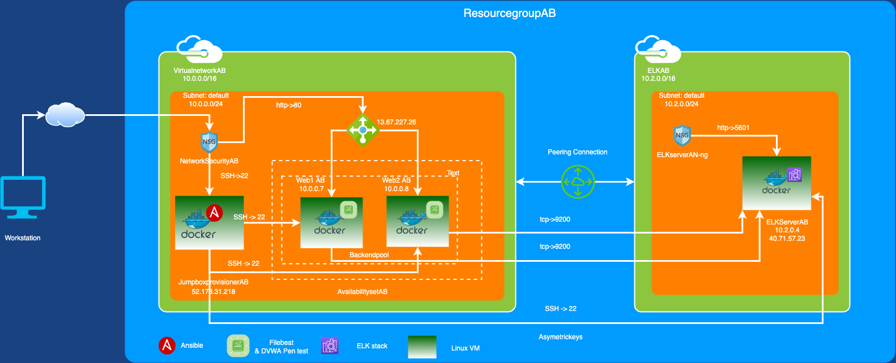
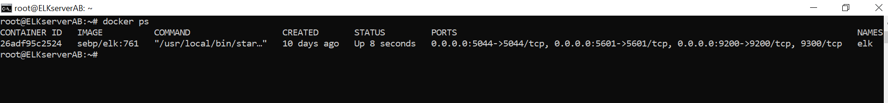

## Automated ELK Stack Deployment

The files in this repository were used to configure the network depicted below.

These files have been tested and used to generate a live ELK deployment on Azure. They can be used to either recreate the entire deployment pictured above.

  - pentest_install.yml
  - filebeat_install.yml
  - metricbeat_install.yml
  - elkserver_install.yml
  
This document contains the following details:
- Description of the Topology
- Access Policies
- ELK Configuration
  - Beats in Use
  - Machines Being Monitored
- How to Use the Ansible Build

### Description of the Topology

The main purpose of this network is to expose a load-balanced and monitored instance of DVWA, the D*mn Vulnerable Web Application.

Load balancing ensures that the application will be highly available, in addition to restricting traffic to the network.
- Load balancer protects against DDos attack. Jumpbox acts as only point of access to other servers in the network.

Integrating an ELK server allows users to easily monitor the vulnerable VMs for changes to the configuration and system logs.
- Filebeat watch for log information
- Metricbeat records the metric from system and service running on a server.

The configuration details of each machine may be found below.

| Name                 | Function  | Ip Address | Operating Sysytem |
|----------------------|-----------|------------|-------------------|
| JumpboxprovisionerAB | gateway   | 10.0.0.4   | Linux             |
| Web1AB               | webserver | 10.0.0.7   | Linux             |
| Web2AB               | webserver | 10.0.0.8   | Linux             |
| ElkserverAB          | elkstack  | 10.2.0.4   | Linux             |

### Access Policies

The machines on the internal network are not exposed to the public Internet. 

Only the jumpbox machine can accept connections from the Internet. Access to this machine is only allowed from the following IP addresses:
- 24.245.37.147

Machines within the network can only be accessed by jumpbox server.
| Name                | Publicly Accesible   | Allow IP Addresses |
|---------------------|----------------------|--------------------|
| JumpboxprovisonerAB | Yes                  | 24.245.37.147      |
| Web1AB              | No                   | 10.0.0.4           |
| Web2AB              | No                   | 10.0.0.4           |
| ElkserverAB         | Yes (Only port 5601) | 24.245.37.147      |
| ElkserverAB         | No (Port 9200)       | 10.0.0.0/16        |

### Elk Configuration

Ansible was used to automate configuration of the ELK machine. No configuration was performed manually, which is advantageous because...
- It avoids manual user errors
- Makes the configuration repeatable
- Allows configuring multiple server at the same time

The playbook implements the following tasks:
- Configure ELK server with enough memory needed for running the stack
- Update apt cache 
- Install pip
- Install docker using pip
- Pull ELK stack container and start container
- Enable docker service so that docker will be started if system is rebooted.

The following screenshot displays the result of running `docker ps` after successfully configuring the ELK instance.

### Target Machines & Beats
This ELK server is configured to monitor the following machines:
- 10.0.0.7
- 10.0.0.8

We have installed the following Beats on these machines:
- Filebeat
- Metricbeat

These Beats allow us to collect the following information from each machine:
- Filebeat collects application and system log information and forwards it to elastic search
- Metricbeat records the metrics from system and service and forwards it to elastic search

### Using the Playbook
In order to use the playbook, you will need to have an Ansible control node already configured. Assuming you have such a control node provisioned: 

SSH into the control node and follow the steps below:
- Copy the playbook file to /etc/ansible directory.
- Update the hosts file to include the server IP for specific group i.e webserver or elk as needed
- Run the playbook, and navigate to http://elkserver-ip:5601/app/kibana to check that the installation worked as expected.

